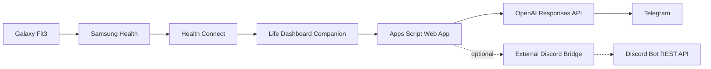

# health-wearable-agent


A personal wearable-health AI agent that turns Galaxy Fit3 / Samsung Health data into a short, casual wellness check-in message.

The project receives Health Connect data from an Android phone, parses the latest wearable metrics in Google Apps Script, asks OpenAI to write a friendly check-in, and sends the final message to Telegram. Optional Discord output should be handled through an external bridge/backend because direct Apps Script calls to the Discord API can be blocked or unreliable.

This is not medical software. It is a personal wellness automation for wearable data.

## Visual Flow

The project is easier to understand as a chain of tools:

<table>
  <tr>
    <td align="center"><br><strong>Galaxy Fit3</strong><br>wearable data</td>
    <td align="center">-></td>
    <td align="center"><br><strong>Samsung Health</strong><br>phone sync</td>
    <td align="center">-></td>
    <td align="center"><br><strong>Health Connect</strong><br>permission layer</td>
    <td align="center">-></td>
    <td align="center"><br><strong>Life Dashboard</strong><br>webhook JSON</td>
  </tr>
  <tr>
    <td align="center"><br><strong>Apps Script</strong><br>parser + webhook</td>
    <td align="center">-></td>
    <td align="center"><br><strong>OpenAI</strong><br>message generation</td>
    <td align="center">-></td>
    <td align="center"><br><strong>Telegram</strong><br>main output</td>
    <td align="center">+</td>
    <td align="center"><br><strong>Discord Bridge</strong><br>optional backend</td>
  </tr>
</table>

The older prototype path also matters because it explains why the final design changed:

<table>
  <tr>
    <td align="center"><br><strong>Samsung Health</strong></td>
    <td align="center">-></td>
    <td align="center"><br><strong>Google Drive CSV</strong></td>
    <td align="center">-></td>
    <td align="center"><br><strong>Apps Script</strong></td>
    <td align="center">-></td>
    <td align="center"><br><strong>Discord webhook</strong></td>
  </tr>
</table>

That prototype worked, but Drive CSV sync and Discord webhooks were not smooth enough for a live check-in agent. The current version uses webhook JSON and Telegram as the main output.

## Contents

- [Visual Flow](#visual-flow)
- [Why This Exists](#why-this-exists)
- [How The Program Works](#how-the-program-works)
- [Architecture](#architecture)
- [What The Apps Script Does](#what-the-apps-script-does)
- [Supported Data Fields](#supported-data-fields)
- [Issues Faced And Solved](#issues-faced-and-solved)
- [Example Output](#example-output)
- [Setup](#setup)
- [Security](#security)

## Why This Exists

The original goal was simple: use data from a Galaxy Fit3 / Samsung Health setup inside an AI agent and receive useful daily wellness messages.

The main discovery was that Samsung Health and Galaxy Fit3 do not provide a simple backend API key that can be pasted into a server to read personal wearable data. The data has to move through Android-side permissions first.

That shaped the final pipeline:

```text
Galaxy Fit3
  -> Samsung Health
  -> Health Connect
  -> Life Dashboard Companion
  -> Google Apps Script Web App
  -> OpenAI
  -> Telegram
```

Google Apps Script was chosen because it is lightweight, easy to deploy as a webhook, and does not require running a permanent server.

## How The Program Works

1. Galaxy Fit3 records wearable data such as steps, heart rate, sleep, oxygen saturation, and exercise.
2. Samsung Health syncs that data from the watch/fitness band.
3. Health Connect stores the Android health data in a permission-controlled layer.
4. Life Dashboard Companion reads selected Health Connect metrics and sends JSON to a webhook.
5. The Apps Script Web App receives the webhook request.
6. The script checks the shared `secret` query parameter to block unauthorized requests.
7. The script parses the incoming JSON into a normalized metrics object.
8. The metrics are sent to the OpenAI Responses API with strict message-style instructions.
9. The AI output is normalized so it stays as one compact paragraph and ends with the required safety note.
10. The final message is sent to Telegram.
11. If `DISCORD_BRIDGE_URL` is configured, Apps Script sends the same message to that external bridge/backend. The bridge is responsible for talking to Discord.

If OpenAI fails, the program still sends a rule-based fallback summary to Telegram. This keeps the automation useful even when the AI request fails.

## Architecture



## What The Apps Script Does

The main implementation lives in `Code.gs`.

The script has four main responsibilities:

- Receive webhook requests through `doPost(e)`.
- Protect the webhook with `WEBHOOK_SECRET`.
- Extract wearable metrics from Life Dashboard JSON.
- Generate and send a wellness check-in message.

The parsing layer is defensive because health connector payloads can vary. For example, the script accepts multiple possible field names for the same type of data:

- Steps: `steps`, `step_count`, `stepCount`
- Heart rate: `heart_rate`, `heartRate`, `heart_rates`, `heartRates`
- Sleep: `sleep`, `sleep_sessions`, `sleepSessions`
- Oxygen: `oxygen_saturation`, `oxygenSaturation`, `blood_oxygen`, `bloodOxygen`, `spo2`
- Exercise: `exercise`, `exercises`, `exercise_sessions`, `exerciseSessions`

The script converts these into a normalized object like:

```json
{
  "raw_timestamp": "2026-06-02T08:00:00.000Z",
  "source": "health_connect",
  "steps": 6240,
  "avg_heart_rate": 68,
  "sleep_hours": 7.8,
  "exercise_minutes": 20,
  "blood_oxygen_avg": 96,
  "blood_oxygen_min": 94,
  "blood_oxygen_max": 98
}
```

That normalized object is what OpenAI receives. This keeps the AI prompt focused and avoids sending messy raw webhook data directly.

## Supported Data Fields

The parser currently supports:

- Steps
- Heart rate
- Sleep, including Life Dashboard `duration_seconds`
- Blood oxygen / oxygen saturation
- Exercise sessions, if Life Dashboard sends them

Missing fields are handled safely as `null`. The agent only summarizes fields included in the Life Dashboard webhook payload.

## Issues Faced And Solved

### No direct Samsung Health API key

The first problem was access. Samsung Health and Galaxy Fit3 do not expose a simple personal API key for backend use.

Solution: use Health Connect as the Android permission layer, then use Life Dashboard Companion to push selected data to a webhook.

### Google Drive CSV sync was not smooth enough

The first prototype used Health Sync to export Samsung Health data into Google Drive CSV files. Apps Script then read those files and calculated metrics.

That worked as a prototype, but it was not ideal for a live agent because file sync timing was inconsistent and the workflow depended on Drive exports.

Solution: replace CSV polling with Life Dashboard Companion webhook JSON. This made the pipeline more direct and better suited for live check-ins.

### Direct Discord from Apps Script was unreliable

Discord webhook output hit reliability/rate-limit behavior during the prototype. Later testing showed the Discord bot works from a PC with the Discord Bot REST API, but the same bot token and channel ID fail from Google Apps Script with HTTP 403 code 40333.

Solution: Telegram remains the primary Apps Script output. Discord is optional through an external bridge/backend, not direct Apps Script -> Discord API calls.

### AI output needed strict formatting

Early AI messages could become too formal, too long, or formatted like a report.

Solution: the OpenAI instruction explicitly requires one paragraph, no title, no date/time/header, no bullet points, and a casual live check-in tone. The script also normalizes whitespace and enforces the final safety sentence.

### Missing or inconsistent payload fields

Health payloads are not guaranteed to include every metric every time, and field names can differ.

Solution: each parser function accepts multiple possible field names and safely returns `null` when data is missing. The AI is only asked to summarize readable metrics.

### OpenAI failure should not break the whole automation

If the OpenAI API fails, a health check-in should still be sent.

Solution: `doPost(e)` catches AI generation errors and uses `buildLifeDashboardSummaryMessage(data)` as a fallback.

### Secrets should not be stored in code

The project needs API keys, bot tokens, chat IDs, and a webhook secret.

Solution: all sensitive values are stored in Apps Script Script Properties. The repository only documents property names and includes an example file without real secrets.

## Example Output

> Sleep is looking solid at 7.8h, steps are at 6,240 so activity is moving nicely, heart rate around 68 bpm is pretty steady, and oxygen at 96% looks okay for this check-in. Lowkey keep it simple: hydrate, take a short walk if you have been sitting a while, and keep listening to how your body feels. Wellness check only — not medical advice.

## Telegram Output

Telegram is the primary output. The generated message is:

- One paragraph only
- No title, date, or formal header
- Casual and friendly
- Framed as a live check-in, not a final daily report
- Ended with the required medical safety note

## Optional Discord Bridge Output

Direct Apps Script -> Discord API calls should be treated as blocked/unreliable because they can fail with HTTP 403 code 40333 even when the same bot token and channel ID work from a PC.

Optional Discord output should go through an external bridge/backend. Apps Script sends a JSON payload to `DISCORD_BRIDGE_URL`, and that backend sends to Discord using its own Discord bot token and channel ID.

Expected bridge request:

```json
{
  "source": "health-wearable-agent",
  "content": "Telegram-ready wellness message",
  "metrics": {
    "steps": 6240,
    "avg_heart_rate": 68,
    "sleep_hours": 7.8
  }
}
```

If `DISCORD_BRIDGE_SECRET` is configured, Apps Script sends it in the `X-Discord-Bridge-Secret` header. If `DISCORD_BRIDGE_URL` is not configured, Discord sending is skipped.

## ADK Test Agent

This repository also contains a small Google ADK test agent in `test_agent/`.

That agent is separate from the Apps Script wearable pipeline. It is a local Python ADK agent with its prompt stored in `test_agent/prompt.py`. See `ADK_AGENT.md` for details.

## Setup

See [SETUP.md](SETUP.md) for the full step-by-step setup.

Use [examples/script-properties.example.json](examples/script-properties.example.json) as the reference for Script Property names.

## Project Page

The static project page lives at [docs/index.html](docs/index.html). To publish it with GitHub Pages, use repository Settings -> Pages -> deploy from branch `main` and folder `/docs`.

## Security

Do not commit real API keys, bot tokens, chat IDs, webhook secrets, webhook URLs, or Drive folder IDs. All secrets must live in Apps Script Script Properties.

Required Script Properties:

- `OPENAI_API_KEY`
- `TELEGRAM_BOT_TOKEN`
- `TELEGRAM_CHAT_ID`
- `WEBHOOK_SECRET`

Optional Script Properties:

- `DISCORD_BRIDGE_URL`
- `DISCORD_BRIDGE_SECRET`

See [SECURITY.md](SECURITY.md) before deploying.
