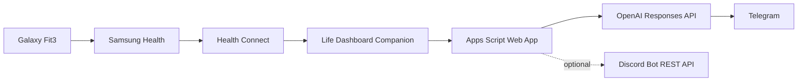

# health-wearable-agent


A personal wearable-health AI agent that receives Health Connect data from an Android phone, turns the latest wearable metrics into a casual wellness check-in with OpenAI, and sends the result to Telegram.

This is not medical software. It is a personal wellness automation for wearable data.

## Contents

- [Architecture](#architecture)
- [Supported Data Fields](#supported-data-fields)
- [Example Output](#example-output)
- [Setup](#setup)
- [Security](#security)

## Architecture



## Supported Data Fields

The Apps Script parser currently supports:

- Steps
- Heart rate
- Sleep, including Life Dashboard `duration_seconds`
- Blood oxygen / oxygen saturation
- Exercise sessions, if Life Dashboard sends them

Missing fields are handled safely as `null`. The agent can only summarize fields included in the Life Dashboard webhook payload.

## Example Output

> Bro sleep is looking solid at 7.8h, steps are at 6,240 so activity is moving nicely, heart rate around 68 bpm is pretty steady, and oxygen at 96% looks okay for this check-in. Lowkey keep it simple: hydrate, take a short walk if you have been sitting a while, and keep listening to how your body feels. Wellness check only — not medical advice.

## Telegram Output

Telegram is the primary output. The generated message is:

- One paragraph only
- No title, date, or formal header
- Casual and friendly
- Framed as a live check-in, not a final daily report
- Ended with the required medical safety note

## Optional Discord Bot Output

Discord webhooks are intentionally not used because they were unreliable in the original prototype. Optional Discord output uses the Discord Bot REST API:

```text
POST https://discord.com/api/v10/channels/{channelId}/messages
Authorization: Bot <token>
```

If `DISCORD_BOT_TOKEN` and `DISCORD_CHANNEL_ID` are not configured, Discord sending is skipped.

## Setup

See [SETUP.md](SETUP.md) for the full step-by-step setup.

Use [examples/script-properties.example.json](examples/script-properties.example.json) as the reference for Script Property names.

## Project Page

The static project page lives at [docs/index.html](docs/index.html). To publish it with GitHub Pages, use repository Settings -> Pages -> deploy from branch `main` and folder `/docs`.

## Security

Do not commit real API keys, bot tokens, chat IDs, webhook secrets, webhook URLs, or Drive folder IDs. All secrets must live in Apps Script Script Properties.

Required Script Properties:

- `OPENAI_API_KEY`
- `TELEGRAM_BOT_TOKEN`
- `TELEGRAM_CHAT_ID`
- `WEBHOOK_SECRET`

Optional Script Properties:

- `DISCORD_BOT_TOKEN`
- `DISCORD_CHANNEL_ID`

See [SECURITY.md](SECURITY.md) before deploying.
